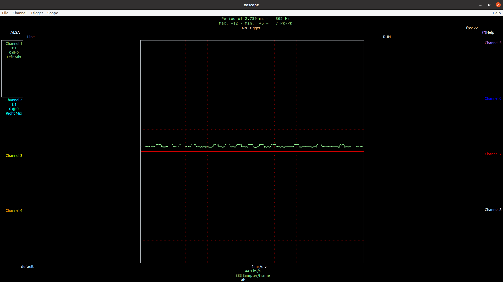
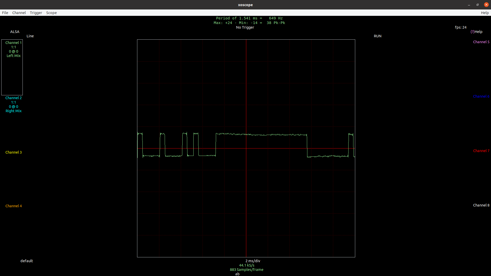
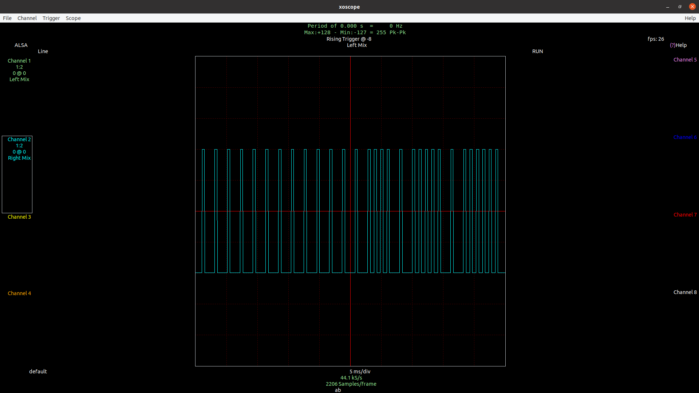

# Initial Steps

I bought some cheap 433 MHz RX modules for use with the Pi off amazon. *2020-08-19:2200, this is a super-regen, super het info [here](../202008192200/update.md)*


Threw together a board with some relays for another project, and the RX and TX module.


The base board is built, but I jumped ahead an made some assumptions.  I assumed the RX module would output a clean 5V output, regardles of RX level.  I am not sure why I thought this.  I built a 5V to 3.3V voltage divider, 22K and 47K.  This would get me to 3.4V.  Great.

Well, this became a 69K pull down.  This added a lot of signal attenuation.

The strength of the signal output from the 433 MHz RX module, is very much so based on the amplitude of the on period.

You can see with this voltage divider / pull down, the signal attunetation is fairly bad at even very close distances

Without having access to an oscilliscope, I pulled down xoscope for linux.  Below is plots based on having the 69K pull down.

```
note: using a microphone input on a PC, at least mine, has a bias removal filter, and will remove and DC signals
```

## Remote and Small Gap



## Remote no Gap



After some debugging, I relized the voltage divider was adding most of the attenuation.


During this, I removed the voltage divider, added a 1M ohm pull up to 3.3V, a current limiting resistor of 1K, and a clamping diode.

## Circuit


After all this, I still have to place the remote basically directly on the antena, but pigpiod is providing callback into python with edges, and I have a nice square wave that looks like its probably 0V to 3.3V.


## Prototype code
You can find the prototype code for using pigpiod and python to capture edges [here](../../prototype/rx_test.py)
