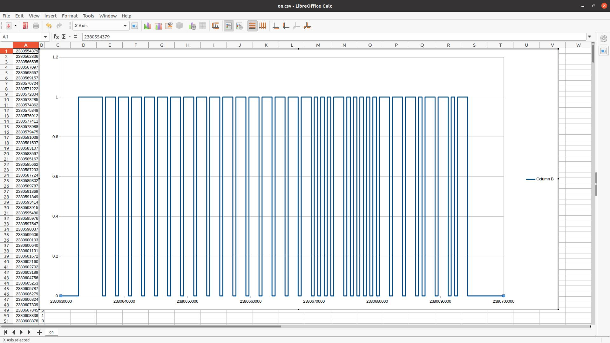

# Cleaned Up

All that was done was to clean up and solder the circuitry together.  The remote still has to sit directly on top of the antenna.

I am not sure if for better sensitivity an op amp is needed, or if the cirucit is just going to be too noisy.  Really we are looking for edges.  As long as its sharp in the analog domain, its a state change.

But for now, just getting data collected from the remote.  It will probably get reorganized, but you can see it in the data folder for this commit.

Here is the CSV data imported into LibreOffice Calc

