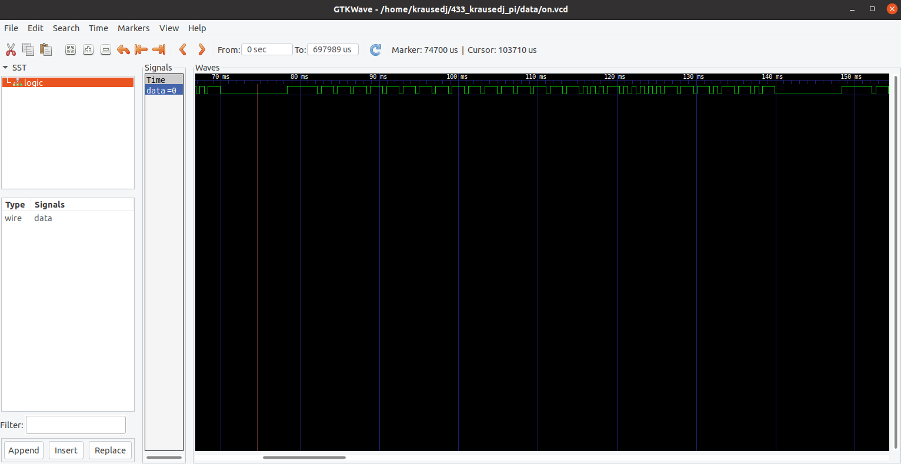
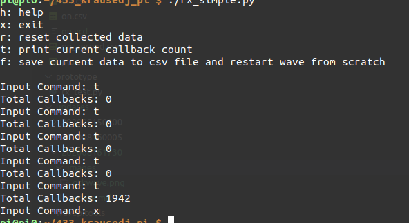

# Success, TX of data

So, the TX module was straight forward.  Using the pigpio, I took the captured waveform from the RX, I added a utility wave_trim.py in this commit, that for now, can only remove the initial offset.

pigpio works in the format of pulses with delta times, and a mask for which GPIO to turn on, and which GPIO to turn off.
- http://abyz.me.uk/rpi/pigpio/python.html#pigpio.pulse
- http://abyz.me.uk/rpi/pigpio/python.html#wave_add_generic

For the purpose of my use case, I don't need to decode the data.  The with playback timing with the accuracy provided, I can pump out the exact wave for I RXed, as a TX wave.

Some functionality moved around, but didn't change.  The addition of VCD output, allows GTKWave to view the data.

## Recapture
I am also able to recapture the data.  If I run the simple TX, while the RX is running, it captures edges.  A next test is to see how far I can RX with a secondary PI.  I have a PI Zero W I will try this with.  I am hopeful the 433 MHz TX module is significally stronger then the remote, so I can chip a status from the attic to the basement, in case wifi is down.
