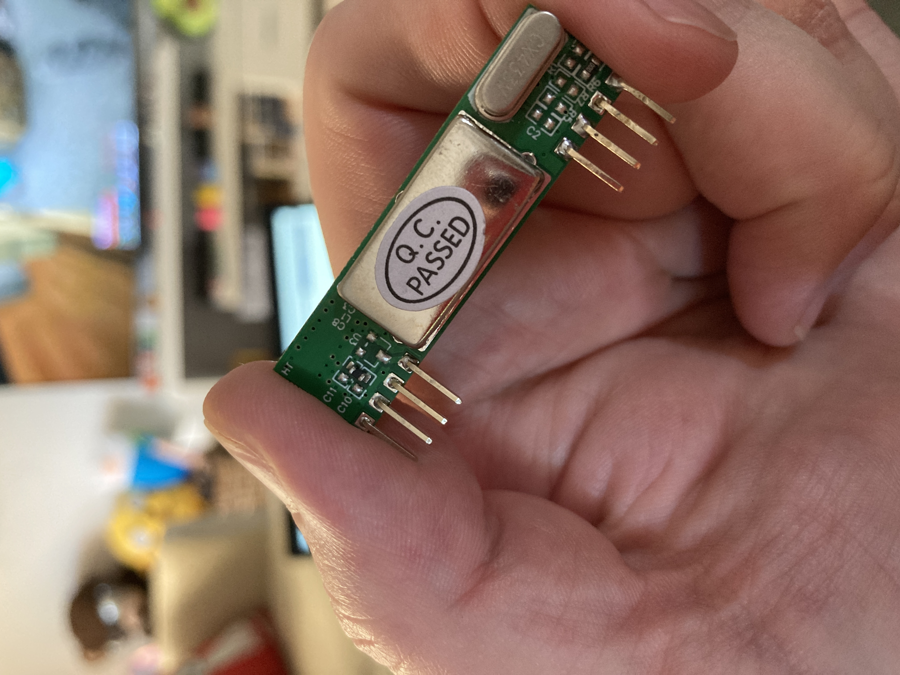
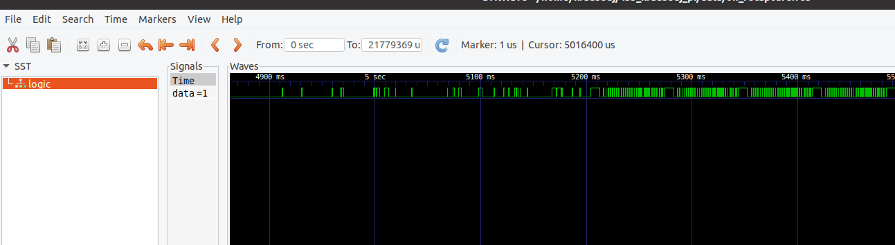

# Superheterodyne vs Super-regenerative

This is not to specifically describe the differences between super het and super regen, but, the effectiveness when being used with the PI.  The Superregen was what was first used.

You can find both type on amazon https://www.amazon.com/s?k=433mhz+receiver

## Super-regen

## Superhet

## Rework

This time went straight to the breadboard.  The superhet used the same support circuitry with the addition of a 100uF capacitor on the 5V power line.  This was added because reading indicated that there may be sensitivity to voltage fluctiations on the super-regen, so it seemed like a safe bet for the superhet as well.

## Results

The sensitivity of the superhet is much higher then the super-regen on the PI.  I had even removed all the circuitry except the clamp diode and still had very poor sensetivity with the super-regen.  It is so high now, that software filtering, and additional analysis is required to find the wave, but the wave is very clear when something is being transmitted.  For this test, I increased the glitch filter.

We can see the remote still working at short and longer range distances.  Even working across the whole house, and my main goal is to go simply from the attic to the basement.

The issue as mentioned, was it requires some engineering to find the actual wave.  The sensitivty is high that when there is no signal, there are lots of glitches.  This is with a 200usec glitch filter.  The start of the trace shows background noise still making it in.  Once the wave is produced, its amplitude overtakes the background noise, and there is a clean wave form.  But it requires searching for it in the trace, either with SW, or manual investigation.

